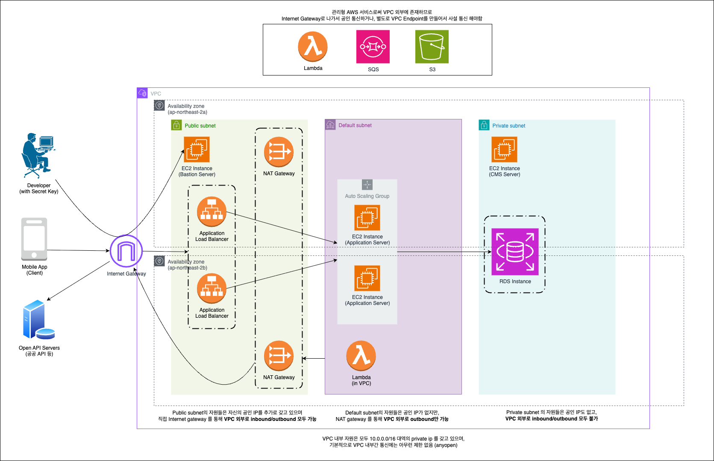

# Service Server
이 저장소는 모바일 앱을 위한 인증 · 사용자 · 약관 도메인을 담당하는 Spring Boot 기반 백엔드 서비스입니다.

`com.service.api` 패키지 아래에 REST API, 외부 소셜 사이트 연동, 토큰 발급 및 검증, 약관 관리 등 핵심 업무 로직이 구성되어 있습니다.


## API 명세 문서
- [API 명세 문서 바로가기](https://ktyu.github.io/service-server-user/api_spec.html)

## AWS 인프라 설계 (프리티어 활용)

위 다이어그램은 프로덕션 배포 환경을 위한 AWS 아키텍처를 설명합니다.
- **Public Subnet**: 인터넷 게이트웨이와 연결된 ALB, NAT GW를 배치하여 인바운드/아웃바운드 트래픽을 구분합니다. 직접 서버에 접속해 관리를 위한 Bastion Host는 개발자들에게만 접속 권한 및 키를 제공합니다.
- **Default Subnet**: 오토 스케일링 그룹으로 운영되는 애플리케이션 서버(EC2)가 위치하며 ALB로부터 트래픽을 수신합니다. Lambda 함수는 동일 VPC 내에서 보조 작업(예: 비동기 처리)을 담당합니다.
- **Private Subnet**: CMS 서버와 RDS 인스턴스를 격리해 두어 외부로 직접 인바운드/아웃바운드를 모두 막고, VPC 내부 애플리케이션 서버를 통해서만 통신합니다.
- **AWS Managed 서비스 연동**: VPC 외부에 위치한 Lambda, SQS, S3 등과는 VPC Endpoint 또는 Internet Gateway를 통해 보안 통신을 구성합니다.

## 주요 패키지 구조
- `com.service.api.controller`
  - `AuthController`: 소셜 로그인 연동, 회원 가입/로그인/토큰 갱신 API를 제공합니다.
  - `TermsController`: 노출 중인 전체 약관 목록을 반환합니다.
  - `HealthController`: ALB 헬스체크 엔드포인트(`/health`).
  - `web_view`: 애플 계정/본인인증 흐름을 위한 웹뷰 리다이렉션 엔드포인트를 정의합니다.
- `com.service.api.service`
  - `UserService`: 약관 검증을 거쳐 사용자 식별/프로필 정보를 생성하고 기존 가입 여부를 판단합니다.
  - `DeviceService`: 요청 헤더에 포함된 디바이스 식별 정보를 활용해 토큰을 발급·갱신하고, 토큰 유효성을 검증합니다.
  - `TermsService`: 약관 버전 동기화 및 필수 항목 검증 로직을 담당합니다.
  - `SocialKakaoService`: Kakao API와 연동하여 소셜 계정 상태를 검증하고 `user_social` 레코드를 관리합니다.
- `com.service.api.filter`
  - `ApiHeaderContextFilter`: 요청 헤더에서 디바이스/앱 메타데이터를 추출해 `ApiRequestContext`에 저장하고 유효성을 검사합니다.
- `com.service.api.persistence`
  - `entity`: JPA 엔티티 정의 (`user_identity`, `user_profile`, `user_social`, `user_device`, `terms`).
  - `repository`: Spring Data JPA 기반 CRUD 저장소.
  - `mapper`: 엔티티와 도메인 모델 간 변환 로직.
- `com.service.api.dto`
  - 인증·회원 관련 요청/응답 DTO와 공통 응답 포맷을 정의합니다.
- `com.service.api.config`
  - `AppConfig`: 컴포넌트 스캔, JPA 설정을 통합합니다.
  - `FilterConfig`: 요청 헤더 필터를 등록합니다.
  - `HttpClientConfig`: Kakao OpenAPI 호출용 `WebClient`를 구성하고 인터셉터로 HTTP 요청/응답 로깅을 수행합니다.

## 핵심 도메인 흐름

1. **소셜 인증**: `AuthController.saveValidSocial` 엔드포인트에서 Kakao 액세스 토큰을 검증하고 내부용 `socialUuid`를 발급합니다.
2. **회원 가입**: `AuthController.signup`이 약관 동의를 검증하고, `UserService`가 사용자 식별/프로필 정보를 생성합니다.
3. **디바이스 관리 및 토큰 발급**: `DeviceService`가 ThreadLocal에 저장된 디바이스 컨텍스트를 기반으로 토큰을 발급하고 `user_device` 테이블을 갱신합니다.
4. **약관 버전 관리**: `TermsService.validateTermsAgreements`가 필수/선택 약관 버전을 검증해 최신 상태를 강제합니다.
5. **외부 API 연동**: `SocialKakaoService`는 `KapiKakaoComClient`를 사용해 Kakao 계정 정보를 가져오고, 이메일 인증 여부를 동기화합니다.

## 추가 자료
- DB는 MySQL 8.4를 사용하며, 테이블 스키마를 정의한 DDL은 `src/main/resources/ddl`에서 확인할 수 있습니다.
- API 상세 스펙은 상단의 HTML 문서를 통해 확인할 수 있습니다.

## 실행 방법
```bash
./gradlew bootRun
```

로컬 실행 시 `application-local.yml`에 정의된 MySQL 접속 정보를 사용하며, 포트는 `18080`입니다. Kakao OpenAPI와 연동할 경우 실제 앱 ID, Admin Key를 환경 변수나 별도 프로파일로 설정해야 합니다.
